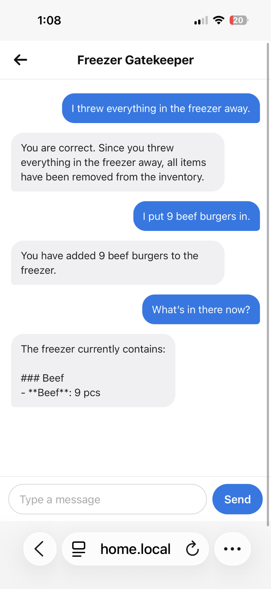

# fridgeWatcher

A small first experiment integrating a local LLM into an application: ask a freezer guardian about inventory, or tell it what you added or used.

## Architecture

A vanilla HTML/CSS/JavaScript chat interface talks to an Express server. The server uses **`qwen3.5:2b-q4_K_M`** through local Ollama and keeps inventory in one local Markdown file, **`data/freezer.md`**.

Every user request follows the same flow:

1. The app reads the inventory file's full current contents.
2. It sends the entire document together with the user's message to the model.
3. The model returns JSON containing an action and a reply. For a modification, it also returns the complete replacement inventory document.
4. The app checks the response's basic structure, saves the replacement document for modifications, and displays the reply. Queries leave the file unchanged.

This is a simple RAG-style approach using whole-file context injection: the Markdown file supplies the context on every request, with no vector database, embeddings, or chunk retrieval.

The small model can make incorrect inventory updates or change unrelated items when rewriting the document. Basic response validation does not guarantee inventory accuracy.

## Screenshot

